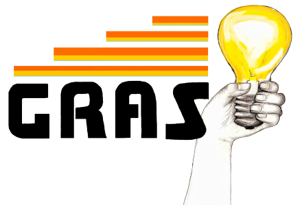

Grasp is an open-source learning management system for Common Core classrooms.
Grasp's primary goal is to leverage technology to seamlessly integrate into
classrooms and improve communication between teachers and students.

## Getting Started

### Prerequisites

* Ruby 2.0+ with Rails
* [PhantomJS](http://phantomjs.org/)

Installation of Ruby and PhantomJS is beyond the scope of this readme.

### Dependencies

Once you have all of the prerequisites installed, head over to the project's
root and run `bundle install` to install all of Grasp's dependencies on your
system.

### Secrets

Secret keys are handled with [Figaro](https://github.com/laserlemon/figaro).
For Grasp to run on your system, you must create `config/application.yml`
containing the following keys and corresponding values.

* `APPLICATION_SECRET` - Application secret as used by Rails
* `DEVISE_SECRET` - Secret key used by Devise
* `CONTACT_EMAIL` - Email to mail contact form to.

### Test Suite

When in the root of the project, run the test suite with:

    $ rspec spec

If this passes, you should be good to go! If not, create an issue on GitHub
thoroughly explaining the steps you went through and any potential errors that
were thrown.

## Contributing

All contributions to Grasp are welcome. Until we establish a formal style
guide, please be prepared to format your code to look like the rest of the
project.

## License

The MIT License (MIT)

Copyright (c) 2013 The Grasp Contributors

Permission is hereby granted, free of charge, to any person obtaining a copy
of this software and associated documentation files (the "Software"), to deal
in the Software without restriction, including without limitation the rights
to use, copy, modify, merge, publish, distribute, sublicense, and/or sell
copies of the Software, and to permit persons to whom the Software is
furnished to do so, subject to the following conditions:

The above copyright notice and this permission notice shall be included in
all copies or substantial portions of the Software.

THE SOFTWARE IS PROVIDED "AS IS", WITHOUT WARRANTY OF ANY KIND, EXPRESS OR
IMPLIED, INCLUDING BUT NOT LIMITED TO THE WARRANTIES OF MERCHANTABILITY,
FITNESS FOR A PARTICULAR PURPOSE AND NONINFRINGEMENT. IN NO EVENT SHALL THE
AUTHORS OR COPYRIGHT HOLDERS BE LIABLE FOR ANY CLAIM, DAMAGES OR OTHER
LIABILITY, WHETHER IN AN ACTION OF CONTRACT, TORT OR OTHERWISE, ARISING FROM,
OUT OF OR IN CONNECTION WITH THE SOFTWARE OR THE USE OR OTHER DEALINGS IN
THE SOFTWARE.
